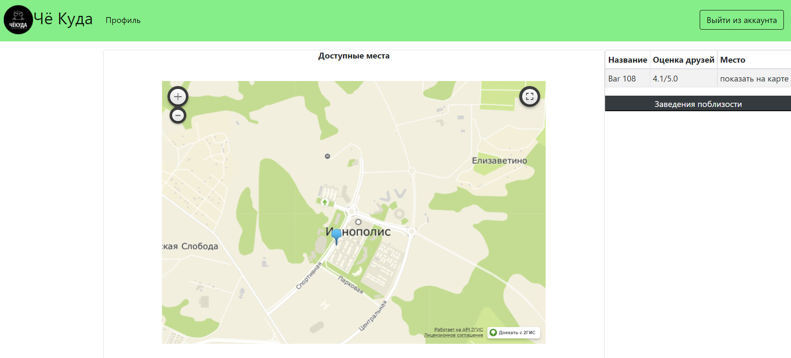

# CheKuda (в разработке)
Проект представляет собой платформу, которая помогает с выбором места, где люди могли бы собраться со своими друзьями. Система оценок ресторанов и кафе должна помочь с выбором. 
 На сайте можно оставить оценку месту, посмотреть места поблизости, написать другу и посмотреть места, которые больше всего нравятся вашим друзьям.

 
## Использую в разработке:
### Backend:
- Spring Boot
- Hibernate
- PostgreSQL
- Maven
### Frontend:
- Freemarker 
- Bootstrap
### Others:
- 2GIS api
- Lombok project
### Текущее состояние
Проект пока не готов
 Deploy на Heroku:
https://che-kuda.herokuapp.com
